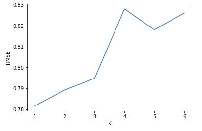
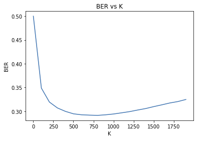

# CSE 258 - Assignment 1
Kaggle username: Haakon Hukkelaas

## 1. Visiting Prediction
The model I chose to use was to use jaccard similarity to find the most similar user for the user we want to predict for. This model ended up with a accuracy of $0.757$ on kaggle. The model has big issues with computing time. Improvements to the model could be incorperating kNN, and extracting better features for the jaccard similarity, however was not done due to time constraints.

### 1.1 Jaccard similarity model
The model computes the jaccard similarity between all users. The jaccard similarity is based on what categories a user has visited before, where we take all the categories for each user and computing the similarity
$$
jaccard = \frac{A \bigcap B}{A \bigcup B}
$$ 

To predict for a given user if he is going to visit the business, we look at the $k$ most similar users and check wether or not they have visited the business. If any of these have visited the business, we return True, else return False.

### 1.2 Computing difficulties
When computing similarities for each user we have to compare each user to all other users. With $20,000$ users, this results in $400,000,000$ computations, and is becoming an infeasible problem. We also tried to compute it for each prediction, but however with $200,000$ test examples this is even worse. 

The computing difficulties makes it hard to test out different features, and resulting in a 30 minute compute time each time you change either number of users or features for each user.

### 1.3 Cross validation
To find the value for $k$ most similar users, I used cross-validation. The best value was $k=750$, which gave a balanced error rate of approximate $0.24$. The graph in (3.3) shows result for k in cross validation.

### 1.4 Improvements
Using kNN to this method could give improvements, but I didn't have time to test it out. By looking at the top similar users for the given user, we could use these to look at the interactions these have had with the business, and use kNN on this. 

## 2. Rating prediction

Latent factor model is the model that resulted in the best rating prediction for both local testing data, as well as on Kaggle. The final score was $RMSE=0,75991$, only $0.00561$ worse than the winning submission. As the number of interactions we have is somewhat sparse, we could improve the model by incorperating features, such as considering the bias toward a given category for a user or business. This report gives an overview of the methods used, and the actual code is given in the appendix.

### 2.1 Latent factor model
The model that resulted in the best result was 

$$
min \sum_{u,i \in U,I} (R_{u,i} - \alpha + \beta_u + \beta_i + \gamma_u \gamma_i^T)^2 + \lambda (\sum_{i \in I} \beta_i^2 + \sum_{u \in U} \beta_u^2
 + \sum_{u \in U} ||\gamma_u||_2^2 + \sum_{i \in I} ||\gamma_i||_2^2)$$
where $\lambda$ is the regularization constant, $\alpha$ is the default bias, $\beta_u, \beta_i$ is the bias for the user and item, and $\gamma_u \gamma_i$ is a dimensionality reduction of the $R_{u,i}$ matrix. Optimizing this can be done by gradient descent, where I used stochastich gradient descent.

The gradient descent should be performed by all the parameters, including $\alpha$. When updating for a user I got the best result when considering all the items he has interacted with to calculate the gradient.

### 2.2 Learning speed
I started doing batch gradient descent of the model, which gave a horrible slow learning speed. Changing to updating $\beta_u, \gamma_u$ for all the users, then updating $beta_i, \gamma_i$ for all items gave a learning speed considerably faster. $\alpha$ was updated for each epoch.

### 2.3 Cross validation
To optimize our model on the test set, I used a cross-validation method to choose the number of dimensions $K$ for $\gamma_i, \gamma_u$, and the regularization constant $\lambda$ to prevent overfitting. In (3.1) in the appendix is given results from cross-validation, where the best results for me was with $\lambda = 4$ and $K=1$.

### 2.4 Improvements
The model currently only uses biases towards a user and a business. Incorperating features such as bias towards categories could be implemented, but was not tried for this submission.

## 3. Appendix
### 3.1 Rating prediction - RMSE vs $\lambda$


### 3.2 Rating prediction - RMSE vs $k$


### 3.3 Visit Prediction - Balanced error rate vs $k$


## 4. Relevant visiting prediction code

```python
def compute_similarities(self):
  self.similarities = np.zeros((self.n_user, self.n_user))
  for u1 in range(self.n_user):
  for u2 in range(u1,self.n_user):
    jacc_sim = jaccard_sim(self.userToCategory[u1], self.userToCategory[u2])
	 self.similarities[u1,u2] = jacc_sim
	 self.similarities[u1, u2] = jacc_sim
  
def set_visited_business(self, k):
  start = time()
  self.userToNeighboursItems = defaultdict(set)
  for u1 in range(self.n_user):
    topUsers = []
  
    # Returns the users with the k highest similarity values (Returns index)
    topUsers = np.argpartition(self.similarities[u1], -k)[-k:]
	
    # Find the most similar user for user u1
    # Go through all the top users and add items they have visited.
    for u2 in topUsers:
      for item in self.userToItem[u2]:
        self.userToNeighboursItems[u1].add(item)
  
def predict(self, u, i):
  topUsers = []
  if u not in self.uniq_users:
    return random.randint(0,1)
    
  u = self.userIdMap[u]
  return i in self.userToNeighboursItems[u]
	
```    
    
	    

## 5. Relevant rating prediction code

```python
def sgd_user_item(self, its, l): 
  errors = []
  test_error = []
  for it in range(its):
    for u in range(len(self.userIdMap.keys())):
      I = self.userToItem[u]
      # 1 user, many items 
      pred = self.alpha + self.b_u[u] + self.b_i[I] + np.dot(self.p[u,:], self.q[I,:].T)
      error_I =  (pred - self.R[u,I])
            
      dBu = l*2*(error_I.sum() + self.reg * self.b_u[u])
      dPu = l*2*((self.q[I].T * error_I).sum() + self.reg*self.p[u])
    
      self.b_u[u] -= dBu
      self.p[u] -= dPu
  
    for i in range(len(self.itemIdMap.keys())):
      U = self.itemToUser[i]
    
      pred = self.alpha + self.b_u[U] + self.b_i[i] + np.dot(self.p[U, :], self.q[i,:].T).T
      error_U = pred - self.R[U,i].T
    
      dBi = l*2*(error_U.sum() + self.reg * self.b_i[i])
      dQi = l*2*((self.p[U].T * error_U).sum() + self.reg*self.q[i])
    
      self.b_i[i] -= dBi
      self.q[i] -= dQi
  	 
    # Update alpha
    train_error = self.alpha + self.b_u
    train_error = sum([self.predict_train(u,i) - self.R[u][i] for u,i in self.x_train]) / float(len(self.x_train))
    self.alpha -= train_error
    errors.append(train_error)
  
```