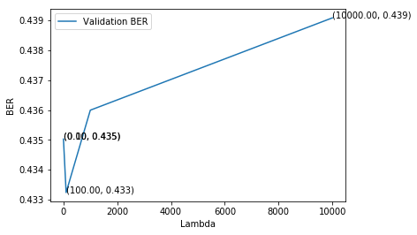
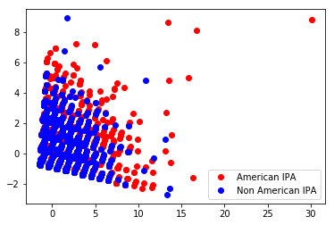

# CSE 258 - Rec. Systems & Web Mining - Homework 2


##### Data extraction


```python
import matplotlib.pyplot as plt
%matplotlib inline
import numpy as np
import scipy.optimize
import random
from math import exp
from math import log
import time
from random import shuffle

def parseData(fname):
  for l in open(fname):
    yield eval(l)

print("Reading data...")

data = list(parseData("beer.json"))
#shuffle(data)

print("done")

def feature(datum):
  feat = [1, datum['review/taste'], datum['review/appearance'], datum['review/aroma'], datum['review/palate'], datum['review/overall']]
  return feat

X = np.array([feature(d) for d in data])
Y = np.array([d['beer/ABV'] >= 6.5 for d in data])

```


##### Logistic regression function


```python
def sigmoid(x):
  return 1.0 / (1 + exp(-x))

##################################################
# Logistic regression by gradient ascent         #
##################################################

# NEGATIVE Log-likelihood
def f(theta, X, y, lam):
  loglikelihood = 0
  # Array of inner products for X_i, theta
  logits = np.dot(X, theta.T)
  for i in range(len(X)):
    if y[i]:
      loglikelihood -= log(1 + exp(-logits[i]))
    else:
      loglikelihood -= log(1 + exp(-logits[i]))
      loglikelihood -= logits[i]
  for k in range(len(theta)):
    loglikelihood -= lam * theta[k]*theta[k]
  #print loglikelihood
  return -loglikelihood

# NEGATIVE Derivative of log-likelihood
def fprime(theta, X, y, lam):
  dl = [0]*len(theta)
  # Inner product of X_i, theta
  logits = np.dot(X, theta.T)
  for i in range(len(X)):
    for k in range(len(theta)):
      if y[i]:
        dl[k] += X[i][k] * (1 - sigmoid(logits[i]))
      else:
        dl[k] += X[i][k] * (1 - sigmoid(logits[i]))
        dl[k] -= X[i][k]
  for k in range(len(theta)):
    dl[k] -= lam*2*theta[k]
  return np.array([-x for x in dl])

def train(lam, X, Y, f, fprime):
  theta,_,_ = scipy.optimize.fmin_l_bfgs_b(f, [0]*len(X[0]), fprime, pgtol = 10, args = (X, Y, lam))
  return theta

def predict(X, theta):
    pred = np.dot(X, theta.T)
    assert pred.shape == (len(X),), "Expected shape: {}, but was: {}".format((len(X),), pred.shape)
    return pred > 0

def accuracy(theta, Y, X):
  predictions = predict(X, theta)
  correct = predictions == Y
  acc = sum(correct) * 1.0 / float(len(correct))
  return acc
```

## Question 1
*The code currently does not perform any train/test splits. Split the data into training, validation, and test sets, via 1/3, 1/3, 1/3 splits. Use the first third, second third, and last third of the data (respectively). After training on the training set, report the accuracy of the classifier on the validation and test sets*

---

### Shuffling the data

I chose to deliver the exercise with the data not shuffled. 
I did get a better accuracy if I shuffled the data.


```python
n = len(X)
X_train, X_test, X_val = (X[0:n/3], X[n/3:2*n/3], X[2*n/3::])
Y_train, Y_test, Y_val = (Y[0:n/3], Y[n/3:2*n/3], Y[2*n/3::])

lam = 1.0
theta = train(lam, X_train, Y_train, f, fprime)
acc_train = accuracy(theta, Y_train, X_train)
acc_test = accuracy(theta, Y_test, X_test)
acc_val = accuracy(theta, Y_val, X_val)

print "Training accuracy: {0:.5f}".format(acc_train)
print "Testing accuracy: {0:.5f}".format(acc_test)
print "Validation accuracy: {0:.5f}".format(acc_val)
```

    Training accuracy: 0.66987
    Testing accuracy: 0.90028
    Validation accuracy: 0.57779


## Question 2

*Let’s come up with a more accurate classifier1 based on a few common words in the review. Build a feature vector to implement a classifier of the form
$$ p(positive label) = \sigma(\theta_0 + \theta_1 \cdot \#'lactic' + \theta_2 \cdot \#'tart'...) $$
where each feature corresponds to the number of times a particular word appears. Base your feature on the following 10 words: “lactic,” “tart,” “sour,” “citric,” “sweet,” “acid,” “hop,” “fruit,” “salt,” “spicy.”*

---


```python
def count_appearances(text, word):
  return text.lower().count(word.lower())

def feature(d, words):
  feat = [1] + [count_appearances(d['review/text'], word) for word in words]
  return feat

words = ["lactic", "tart", "sour", "citric", "sweet", "acid", "hop", "fruit", "salt", "spicy"]

X = np.array([feature(d, words) for d in data])
```


```python
n = len(X)
X_train, X_test, X_val = (X[0:n/3], X[n/3:2*n/3], X[2*n/3::])
Y_train, Y_test, Y_val = (Y[0:n/3], Y[n/3:2*n/3], Y[2*n/3::])

lam = 1.0
theta = train(lam, X_train, Y_train, f, fprime)
acc_train = accuracy(theta, Y_train, X_train)
acc_test = accuracy(theta, Y_test, X_test)
acc_val = accuracy(theta, Y_val, X_val)

print "Training accuracy: {0:.5f}".format(acc_train)
print "Testing accuracy: {0:.5f}".format(acc_test)
print "Validation accuracy: {0:.5f}".format(acc_val)
```

    Training accuracy: 0.59018
    Testing accuracy: 0.67067
    Validation accuracy: 0.53159


## Question 3 

*Report the number of true positives, true negatives, false positives, false negatives, and the Balanced Error Rate of the classifier on the test set (1 mark)*

---


```python
def true_positive(Y, predictions):
  TP = np.sum(np.logical_and(predictions == 1, Y == 1))
  return TP

def true_negative(Y, predictions):
  TN = np.sum(np.logical_and(predictions == 0, Y == 0))
  return TN

def false_positive(Y, predictions):
  FP = np.sum(np.logical_and(predictions == 1, Y == 0))
  return FP

def false_negative(Y, predictions):
  FN = np.sum(np.logical_and(predictions == 0, Y == 1))
  return FN

def balanced_error_rate(Y, predictions): 
  TP = true_positive(Y, predictions)
  FP = false_positive(Y, predictions)
  FN = false_negative(Y, predictions)
  TN = true_negative(Y, predictions)
  TPR = TP / float((TP + FN))
  TNR = TN / float((TN + FP))
  return 1. - 0.5 * (TPR + TNR)

```


```python
predictions = predict(X_test, theta)
print "True Positive:", true_positive(Y_test, predictions)
print "True Negative:", true_negative(Y_test, predictions)
print "False Positive:", false_positive(Y_test, predictions)
print "False Negative:", false_negative(Y_test, predictions)
print "Balanced Error rate:", balanced_error_rate(Y_test, predictions)
```

    True Positive: 10841
    True Negative: 337
    False Positive: 421
    False Negative: 5068
    Balanced Error rate: 0.436985395665


## Question 4 
*Our classifier is possibly less effective than it could be due to the issue of class imbalance (i.e., an uneven number of the datapoints have a positive label). Show how you would adjust the gradient ascent code provided such that the classifier would be approximately ‘balanced’ between the positive and negative classes. Report the Balanced Error Rate (on the train/validation/test sets) for the new classifier*


---
We have our log-likelihood:


$$
L_{\theta}(Y|X) = \frac{n}{2  |y =1|} \sum_{y_i=1} -log(1 + e^{-X_i \cdot \theta}) + \frac{n}{2  |y =0|} \sum_{y_i=0} -log(1 + e^{-X_i \cdot \theta} 
- X_i \cdot \theta + \lambda ||\theta||_2^2
$$

$$
\frac{dL_{\theta}(Y|X)}{d \theta} = \frac{n}{2  |y =1|} \sum_{y=1} X_{ik} (1- \sigma (X_i \theta)) + \frac{n}{2  |y =0|} \sum_{y=0} X_{ik} (1- \sigma (X_i \theta)) - X_{ik} - 2 \lambda \theta_k
$$


We see an improvement of about 2% on the BER. This improvement is more clear if the dataset would be more imbalanced, or if we had shuffled the data.


```python
def get_weight_const(y):
  n = float(len(y))
  y1 = float(np.count_nonzero(y))
  y0 = n - y1
  c1 = n / (y1*2.)
  c0 = n / (y0*2.)
  return c0, c1

# Negative log likelihood
def f(theta, X, y, lam):
  c0, c1 = get_weight_const(y)
  loglikelihood = 0
  # Array of inner products for X_i, theta
  logits = np.dot(X, theta.T)
  for i in range(len(X)):
    if y[i]:
      loglikelihood -= log(1 + exp(-logits[i])) * c1
    else:
      loglikelihood -= log(1 + exp(-logits[i])) * c0
      loglikelihood -= logits[i] * c0
  for k in range(len(theta)):
    loglikelihood -= lam * theta[k]*theta[k]
  #print loglikelihood
  return -loglikelihood

# NEGATIVE Derivative of log-likelihood
def fprime(theta, X, y, lam):
  c0, c1 = get_weight_const(y)
  dl = [0]*len(theta)
  # Inner product of X_i, theta
  logits = np.dot(X, theta.T)
  for i in range(len(X)):
    for k in range(len(theta)):
      if y[i]:
        dl[k] += X[i][k] * (1 - sigmoid(logits[i])) * c1
      else:
        dl[k] += X[i][k] * (1 - sigmoid(logits[i])) * c0
        dl[k] -= X[i][k] * c0
  for k in range(len(theta)):
    dl[k] -= lam*2*theta[k]
  return np.array([-x for x in dl])

def print_metrics(X, Y, theta):
  predictions  = predict(X, theta)
  print "True Positive:", true_positive(Y, predictions)
  print "True Negative:", true_negative(Y, predictions)
  print "False Positive:", false_positive(Y, predictions)
  print "False Negative:", false_negative(Y, predictions)
  print "Balanced Error rate:", balanced_error_rate(Y, predictions)
  print "Accuracy:", accuracy(theta, Y, X)
```


```python
n = len(X)
X_train, X_test, X_val = (X[0:n/3], X[n/3:2*n/3], X[2*n/3::])
Y_train, Y_test, Y_val = (Y[0:n/3], Y[n/3:2*n/3], Y[2*n/3::])

lam = 1.0
theta = train(lam, X_train, Y_train, f, fprime)
print "-----\nTraining statistics:"
print_metrics(X_train, Y_train, theta)
print "-----\nTesting statistics:"
print_metrics(X_test, Y_test, theta)
print "-----\nValidation statistics:"
print_metrics(X_val, Y_val, theta)


```

    -----
    Training statistics:
    True Positive: 4037
    True Negative: 5191
    False Positive: 2127
    False Negative: 5311
    Balanced Error rate: 0.429398051101
    Accuracy: 0.553702148086
    -----
    Testing statistics:
    True Positive: 6971
    True Negative: 559
    False Positive: 199
    False Negative: 8938
    Balanced Error rate: 0.412176667395
    Accuracy: 0.451790964181
    -----
    Validation statistics:
    True Positive: 2414
    True Negative: 7761
    False Positive: 2994
    False Negative: 3498
    Balanced Error rate: 0.435030045502
    Accuracy: 0.610487790244


## Question 5 
*Implement a training/validation/test pipeline so that you can select the best model based on its perfor- mance on the validation set. Try models with*
$$\lambda =  \left(\begin{array}
00 & 0.01 & 0.1 & 1 & 100
\end{array}\right)
$$

*Report the performance on the training/validation/test sets for the best value of λ (1 mark).*

--- 

The choice of the best $\lambda$ is based on the best BER value. There is barely any difference between the $lambda$ values. We see from the graph that the best value is $\lambda = 100$


```python
def get_ber(lam, f, fprime, X, Y):
  n = len(X)
  X_train, X_test, X_val = (X[0:n/3], X[n/3:2*n/3], X[2*n/3::])
  Y_train, Y_test, Y_val = (Y[0:n/3], Y[n/3:2*n/3], Y[2*n/3::])
  
  # Find theta on training data
  theta = train(lam, X_train, Y_train, f, fprime)
  # Tune the lambda with validation set
  predictions = predict(X_val, theta)
  # Tune the lambda with validation set
  ber = balanced_error_rate(Y_val, predictions)
  print "lam={} \t ber={}".format(lam, ber)
  return ber

lams = [0, 0.01, 0.1, 1, 100,1000,10000]
bers = []
for lam in lams:
  b = get_ber(lam, f, fprime, X, Y)
  bers.append(b)

```

    lam=0 	 ber=0.435030045502
    lam=0.01 	 ber=0.435030045502
    lam=0.1 	 ber=0.435030045502
    lam=1 	 ber=0.435030045502
    lam=100 	 ber=0.433237695404
    lam=1000 	 ber=0.435994697371
    lam=10000 	 ber=0.439084764993


```python
for xy in zip(lams, bers):                                       # <--
  plt.annotate('(%.2f, %.3f)' % xy, xy=xy, textcoords='data') # <--
plt.plot(lams, bers)
plt.show()
```




```python
lam = 100
theta = train(lam, X_train, Y_train, f, fprime)
print "-----\nTraining statistics:"
print_metrics(X_train, Y_train, theta)
print "-----\nTesting statistics:"
print_metrics(X_test, Y_test, theta)
print "-----\nValidation statistics:"
print_metrics(X_val, Y_val, theta)


```

    -----
    Training statistics:
    True Positive: 4028
    True Negative: 5191
    False Positive: 2127
    False Negative: 5320
    Balanced Error rate: 0.429879437493
    Accuracy: 0.553162126485
    -----
    Testing statistics:
    True Positive: 6951
    True Negative: 559
    False Positive: 199
    False Negative: 8958
    Balanced Error rate: 0.412805242415
    Accuracy: 0.45059098818
    -----
    Validation statistics:
    True Positive: 2422
    True Negative: 7785
    False Positive: 2970
    False Negative: 3490
    Balanced Error rate: 0.433237695404
    Accuracy: 0.612407751845


# Dimensionality Reduction

## Question 6

*Find and report the PCA components (i.e., the transform matrix) using the week 3 code (1 mark).*

---


```python
from sklearn.decomposition import PCA

def feature(d, words):
  feat = [count_appearances(d['review/text'], word) for word in words]
  return feat

X = np.array([feature(d, words) for d in data])
n = len(X)
X_train, X_test, X_val = (X[0:n/3], X[n/3:2*n/3], X[2*n/3::])
Y_train, Y_test, Y_val = (Y[0:n/3], Y[n/3:2*n/3], Y[2*n/3::])

pca = PCA(n_components=10)
pca.fit(X_train)
assert pca.components_.shape == (10,10)
print "PCA Components:\n", pca.components_
```

    PCA Components:
    [[ -9.45257253e-04   1.16974959e-02  -1.19664614e-02   1.33419235e-02
        1.05120403e-01   1.79457226e-03   9.84741210e-01   1.35598399e-01
        4.59479736e-04   1.96255971e-02]
     [  2.46324777e-03   4.44171070e-02   9.50488366e-03   6.73602998e-04
        9.71555003e-01   4.10505891e-03  -1.30790119e-01   1.91579045e-01
        1.50095154e-03   1.35440738e-02]
     [  3.12946664e-03   4.73537038e-02   3.91534945e-02   4.54565212e-03
       -2.09090111e-01   7.94925530e-03  -1.11771416e-01   9.69193701e-01
        4.66470642e-03   2.36911504e-02]
     [  2.44184954e-02   8.52307858e-01   5.11850323e-01   1.05866679e-02
       -3.00524596e-02   6.13076186e-02   7.91979830e-03  -6.94293166e-02
        7.88854563e-03   3.55677425e-02]
     [  1.48663270e-02  -5.14637213e-01   8.54122237e-01  -6.91810409e-04
        1.82955353e-02   4.94690178e-02   1.58337230e-02  -2.85756422e-03
        1.48501252e-03  -4.85723030e-02]
     [ -1.28725003e-03  -5.75843509e-02   2.25235922e-02   1.99339209e-02
       -8.34344105e-03  -2.00852484e-03  -1.47079995e-02  -2.60907462e-02
        9.51344725e-03   9.97354755e-01]
     [  5.16369601e-02  -2.90830572e-02  -7.56801248e-02   9.70399509e-02
       -1.71751065e-03   9.90445149e-01  -2.77141140e-03  -5.03908378e-03
        1.80529183e-02  -2.07583964e-04]
     [ -7.30288990e-04  -6.00536639e-03   1.86080502e-03   9.94682746e-01
       -4.54461097e-04  -9.78693982e-02  -1.20984145e-02  -4.71662393e-03
        1.94848735e-02  -2.09587724e-02]
     [ -2.88451970e-02  -4.72919315e-03  -3.78650750e-03  -2.13087363e-02
       -1.71496671e-04  -1.50688581e-02   5.69090889e-04  -3.84856859e-03
        9.99172448e-01  -9.45372677e-03]
     [  9.97830328e-01  -1.21473763e-02  -2.15713103e-02  -5.13607957e-03
       -1.10736033e-03  -5.40352929e-02   1.30860212e-03  -1.53010910e-03
        2.77432338e-02   7.72869389e-04]]


## Question 7
*Suppose we want to compress the data using just two PCA dimensions. How large is the reconstruction
error when doing so (1 mark)?*

---


The reconstruction error is given by
$$ 
\frac{1}{N} \sum_y \sum_{j=k+1}^M (y_j - \bar{y_j})^2
$$
This is also the same as the variance of the discarded dimensions


#### Found from taking the mean-squared error directly


```python
pca = PCA(n_components=2)
pca.fit(X_train)
X_pca = pca.transform(X_train)
X_reconstructed = pca.inverse_transform(X_pca)
((X_train - X_reconstructed) **2).mean()
```


    0.12228045087666031


#### Found from taking the variance of the discarded dimensions


```python
pca10 = PCA(n_components=10)
pca10.fit(X_train)
xpca = pca10.transform(X_train)
var = np.var(xpca, axis=0)
sum(var[2::]) / 10
```


    0.12228045087665665


## Question 8 
*Looking at the first two dimensions of our data in the PCA basis is an effective way to ‘summarize’ the data via a 2-d plot. Using a plotting program of your choice, make a 2-d scatterplot showing the difference between ‘American IPA’ style beers versus all other styles (e.g. plot American IPAs in red and other styles in blue) *

---


```python
pca = PCA(n_components=2)
pca.fit(X_train)
X_pca = pca.transform(X_train)
tmask = np.where(Y_train==1)[0]
fmask = np.where(Y_train==0)[0]

print X_pca.shape
Xt = X_pca[tmask]
Xf = X_pca[fmask]

plt.plot(Xt[:,0], Xt[:,1], 'ro', label='American IPA')
plt.plot(Xf[:,0], Xf[:,1], 'bo', label='Non American IPA')
#plt.plot(X_pca[tlabel], 'ro', label='American IPA')
plt.legend()
plt.show()
```




