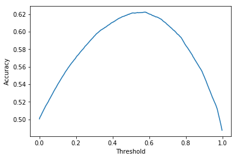
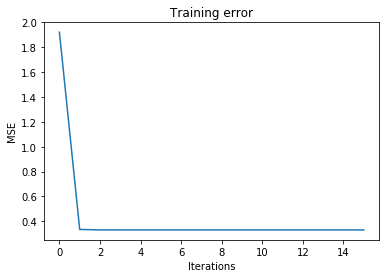
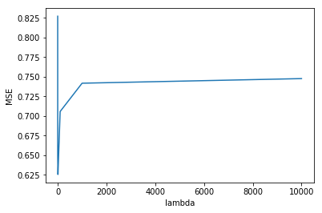

# CSE 258 - Homework 3

## Visit Prediction


```python
import gzip
from collections import defaultdict
import numpy as np
from random import sample, randint
from sklearn.metrics import accuracy_score
import matplotlib.pyplot as plt
```


```python
def readGz(f):
  for l in gzip.open(f):
    yield eval(l)
data = list(readGz('train.json.gz'))
```


```python
data_train = data[0:100000]
data_test = data[100000::]
```


```python
# Build up dictionaries from string to int [0-#users]
unique_users = list(set([d['userID'] for d in data_train]))
unique_business = list(set([d['businessID'] for d in data_train]))
userIds = dict(zip(unique_users, range(len(unique_users))))
businessIds = dict(zip(unique_business, range(len(unique_business))))
num_users = len(unique_users)
num_business = len(unique_business)
```


```python
# Binary matrix to note if a business is visited or not
visited = np.zeros((num_users, num_business))
for d in data_train:
  uId = userIds[d['userID']]
  bId = businessIds[d['businessID']]
  visited[uId][bId] = 1
```


```python
data_test_negative = np.empty((0,2))

non_visited = np.where(visited == 0)
```


```python
# Randomly select 100,000 indexes for negative samples
not_visited_mask = sample(range(len(non_visited[0])), 100000)
```


```python
X_test_negative = zip(non_visited[0][not_visited_mask], non_visited[1][not_visited_mask])
```


```python
Y_test = [0 for i in range(len(X_test_negative))] + [1 for i in range(len(data_test))]

X_test = [[unique_users[x[0]], unique_business[x[1]]] for x in X_test_negative]
X_test += [[d['userID'], d['businessID']] for d in data_test]
```

#### Baseline


```python
businessCount = defaultdict(int)
totalPurchases = 0
for l in data_train:
  user,business = l['userID'],l['businessID']
  businessCount[business] += 1
  totalPurchases += 1

mostPopular = [(businessCount[x], x) for x in businessCount]
mostPopular.sort()
mostPopular.reverse()

class BaselinePredictor:
  
  def train(self, mostPopular, threshold):

    self.return1 = set()
    count = 0
    for ic, i in mostPopular:
      count += ic
      self.return1.add(i)
      if count > int(totalPurchases * threshold): break
  
  def predict(self,bid):
    return bid in self.return1
```

## 1

*Although we have built a validation set, it only consists of positive samples. For this task we also need examples of user/business pairs that weren’t visited. Build such a set by randomly sampling users and businesses until you have 100,000 non-visited user/business pairs. This random sample combined with your 100,000 validation reviews now corresponds to the complete validation set for the visit prediction task. Evaluate the performance (accuracy) of the baseline model on the validation set you have built (1 mark).*

---


```python
predictor = BaselinePredictor()
predictor.train(mostPopular, 0.5)
```


```python
y_result = [predictor.predict(x[1]) for x in X_test]
```


```python
print "MSE", accuracy_score(y_result, Y_test)
```

    MSE 0.620765


## 2

*The existing ‘visit prediction’ baseline just returns True if the business in question is ‘popular,’ using a threshold of the 50th percentile of popularity (totalVisits/2). Assuming that the ‘non-visited’ test examples are a random sample of user-visit pairs, is this particular threshold value the best? If not, see if you can find a better one (and report its performance), or if so, explain why it is the best (1 mark).*

---

We see that the maximum for the test set is 57%.


```python
accs = []
for threshold in range(1,1000):
  p = BaselinePredictor()
  p.train(mostPopular, threshold / 1000.)
  y_result = [p.predict(x[1]) for x in X_test]
  accs.append(accuracy_score(y_result, Y_test))
```


```python
print "Maximum accuracy:" , max(accs)
print "Threshold for max:", accs.index(max(accs)) / 1000.
```

    Maximum accuracy: 0.62249
    Threshold for max: 0.579


```python
plt.xlabel("Threshold")
plt.ylabel("Accuracy")
plt.plot(np.array(range(len(accs))) / 1000., accs)
plt.show()
```





# 3 

*Users may tend to repeatedly visit business of the same type. Build a baseline that returns ‘True’ if a user has visited a business of the same category before (at least one category in common), or zero otherwise (1 mark).1*

---


```python
# user to categories
userCategoriesVisited = defaultdict(set)
for d in data_train:
  uId = d['userID']
  for c in d['categories']:
    userCategoriesVisited[uId].add(c)

# Business to categories 
businessCategories = defaultdict(set)
for d in data_train:
  bId = d['businessID']
  for c in d['categories']:
    businessCategories[bId].add(c)    
```


```python
# Return true if user has visited the category before
def predict(d):
  uId = d['userID']
  for c in d['categories']:
    if c in userCategoriesVisited[uId]:
      return 1
  return 0
```

# 4
*To run our model on the test set, we’ll have to use the files ‘pairs Visit.txt’ to find the userID/businessID pairs about which we have to make predictions. Using that data, run the above model and upload your solution to Kaggle. Tell us your Kaggle user name (1 mark). If you’ve already uploaded a better solution to Kaggle, that’s fine too!*

---

Submitted under name **Haakon Hukkelaas**


```python
def predict(userId, businessId):
  # If business not observed, return random
  if not businessId in businessIds.keys():
    return randint(0,1)
  categories = businessCategories[businessId]
  for c in categories:
    if c in userCategoriesVisited[userId]:
      return 1 
  return 0
  
```


```python
predictions = open("predictions_Visit.txt", 'w')
for l in open("pairs_Visit.txt"):
  if l.startswith("userID"):
    #header
    predictions.write(l)
    continue
  u,i = l.strip().split('-')
  p = predict(u, i)
  predictions.write(u + '-' + i + ",{}\n".format(p))

predictions.close()
```


# 5 
*What is the performance of a trivial predictor*
$$ rating(user, item) = \alpha $$

*on the validation set, and what is the value of α (1 mark)?*

---
Alpha and MSE given below


```python
data_train = data[0:100000]
data_test = data[100000::]
```


```python
y_train = np.array([d['rating'] for d in data_train ])
y_test = np.array([d['rating'] for d in data_test])
```

```python
alpha = np.mean(y_train)
```


```python
def predict(alpha):
  return alpha

def mse(predictions, y):
  return np.dot((predictions-y), (predictions-y).T) / float(len(y))
```


```python
predictions = [predict(alpha) for d in data_test]
print "MSE:", mse(predictions, y_test)
```

    MSE: 0.7483437445


```python
print "Alpha:", alpha
```

    Alpha: 4.18703


# 6

*Fit a predictor of the form*
$$ rating(user, item) ≃ \alpha + \beta_{user} + \beta_{item}$$ 

*by fitting the mean and the two bias terms as described in the lecture notes. Use a regularization
parameter of λ = 1. Report the MSE on the validation set (1 mark).*

---


```python
# Map string ID to integer ID
uniq_users = list(set([d['userID'] for d in data_train]))
uniq_items = list(set([d['businessID'] for d in data_train]))
num_users = len(uniq_users)
num_items = len(uniq_items)
userIds = dict(zip(uniq_users, range(num_users)))
itemIds = dict(zip(uniq_items, range(num_items)))
```


```python
def feat(d):
  uid = d['userID']
  bid = d['businessID']
  return [userIds[uid], itemIds[bid]]
```


```python
def predict(x,b_u, b_i, alpha):
  pred = np.zeros(len(x))
  for j in range(len(x)):
    u,i = x[j]
    pred[j] = alpha + b_u[u] + b_i[i]
  return pred
```


```python
# Build rating matrix, businesses visited by user and users that visited a business
R = np.zeros((num_users, num_items))
nums = np.zeros((num_users, num_items))
userToItem = defaultdict(list)
itemToUser = defaultdict(list)
for d in data_train:
  u = userIds[d['userID']]
  i = itemIds[d['businessID']]
  R[u][i] = d['rating']
  nums[u][1] += 1
  userToItem[u].append(i)
  itemToUser[i].append(u)

nums[nums == 0] = 1
# Get the average R for the user if he has visited more than once...
R /= nums 
```


```python
# Gradient descent based on the lecture notes
def gradient_descent(x, y, b_u, b_i, alpha, max_its, reg):
  preds = predict(x, b_u, b_i, alpha)
  mse = [mean_squared_error(preds, y)]
  for it in range(max_its):
    for j in range(len(x)):
      u = x[j][0]
      i = x[j][1]
      
      # Update rules from lecture
      # Update for user
      userItems = userToItem[u]
      b_u[u] = (- alpha * len(userItems) - b_i[userItems].sum() + R[u,userItems].sum()) / (reg + len(userItems))
      
      # Update for item
      itemUsers = itemToUser[i]
      b_i[i] = (- alpha * len(itemUsers) - b_u[itemUsers].sum() + R[itemUsers, i].sum()) / (reg + len(itemUsers))
      
    # Calculate MSE 
    preds = predict(x, b_u, b_i, alpha)
    mse.append(mean_squared_error(preds, y))
  return alpha, b_i, b_u, mse

```


```python
x_train = np.array([feat(d) for d in data_train])
y_train = np.array([d['rating'] for d in data_train])
```


```python
# Random initialize variables
b_u = np.random.random((num_users,))
b_i = np.random.random((num_items))
alpha = y_train.mean()
```


```python
def predict_test(d, b_u, b_i, alpha):
  try:
    u = userIds[d['userID']]
    i = itemIds[d['businessID']]
    return alpha + b_u[u] + b_i[i]
  except KeyError:
    return alpha
```


```python
alpha, b_i, b_u, e = gradient_descent(x_train, y_train, b_u, b_i, alpha, 15, 1)
```


```python
pred_test = [predict_test(d, b_u, b_i, alpha) for d in data_test]
print "MSE", mean_squared_error(pred_test, y_test)
```

    MSE 0.648634092335


```python
plt.title("Training error")
plt.xlabel("Iterations")
plt.ylabel("MSE")
plt.plot(range(len(e)),e)
plt.show()
```





# 7
*Report the user and item IDs that have the largest and smallest values of β (1 mark).*

---

User with highest: $U357799541$

Business with hightest: $B093985406$


```python
max_user = b_u.max()
userId = np.where(b_u == max_user)[0][0]
print "Max user:", uniq_users[userId]
```

    Max user: U357799541


```python
max_item = b_i.max()
itemID = np.where(b_i == max_item)[0][0]
print "Max business:", uniq_items[itemID]
```

    Max business: B093985406


# 8

*Find a better value of λ using your validation set. Report the value you chose, its MSE, and upload your solution to Kaggle by running it on the test data (1 mark).* 

---


```python
lambdas = [0.0001, 0.001, 0.01, 0.1, 1.0, 10.0, 100.0, 1000.0, 10000.0]

def lambda_check(lambdas):

  mses = []
  for lam in lambdas:
    b_u = np.random.random((num_users,))
    b_i = np.random.random((num_items))
    alpha = y_train.mean()
    alpha, b_i, b_u, e = gradient_descent(x_train, y_train, b_u, b_i, alpha, 20, lam)
    preds = [predict_test(d, b_u, b_i, alpha) for d in data_test]
    e = mean_squared_error(y_test, preds)
    mses.append(e)
    print "lambda: {} \t mse: {}".format(lam, e)
  return mses

mses = lambda_check(lambdas)
```

    lambda: 0.0001 	 mse: 0.82712729579
    lambda: 0.001 	 mse: 0.826593242313
    lambda: 0.01 	 mse: 0.819672128553
    lambda: 0.1 	 mse: 0.774251526081
    lambda: 1.0 	 mse: 0.648634092355
    lambda: 10.0 	 mse: 0.625439249463
    lambda: 100.0 	 mse: 0.705702377675
    lambda: 1000.0 	 mse: 0.74175595841
    lambda: 10000.0 	 mse: 0.747630402932


```python
plt.xlabel("lambda")
plt.ylabel("MSE")
plt.plot(lambdas, mses)
```





#### Kaggle submission

From the graph we see that $\lambda = 10$ gives the best MSE (0.625439) for the validation set. We therefore use this.

The MSE on kaggle is 0.77603


```python
b_u = np.random.random((num_users,))
b_i = np.random.random((num_items))
alpha = y_train.mean()
alpha, b_i, b_u, e = gradient_descent(x_train, y_train, b_u, b_i, alpha, 15, 10)
pred_test = [predict_test(d, b_u, b_i, alpha) for d in data_test]
print "MSE", mean_squared_error(pred_test, y_test)
```

    MSE 0.625439249463


```python
predictions = open("predictions_Rating.txt", 'w')
for l in open("pairs_Rating.txt"):
  if l.startswith("userID"):
    #header
    predictions.write(l) 
    continue
  u,i = l.strip().split('-')
  p = predict_test({'userID': u, 'businessID': i}, b_u, b_i, alpha)
  predictions.write(u + '-' + i + ',' + str(p) + '\n')

predictions.close()
```
